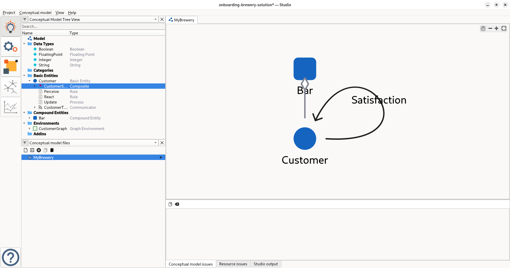
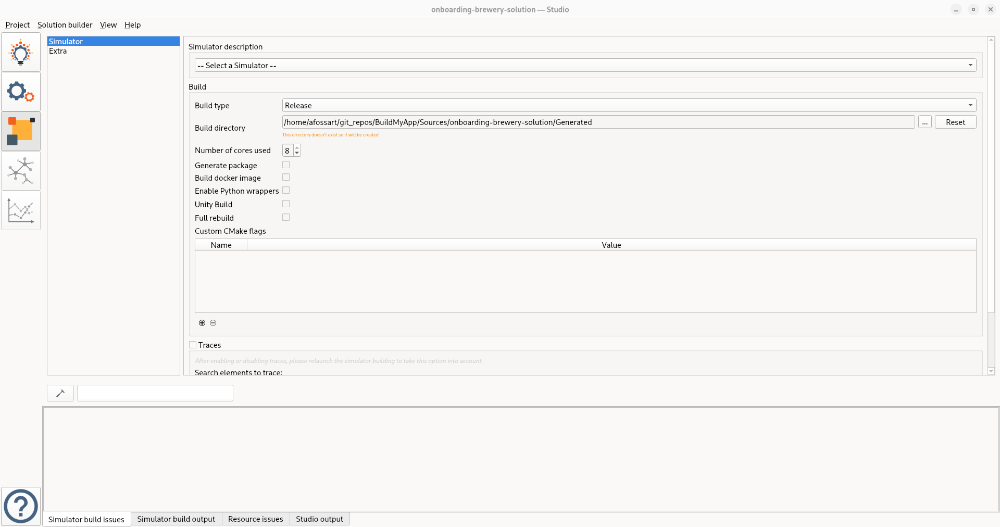
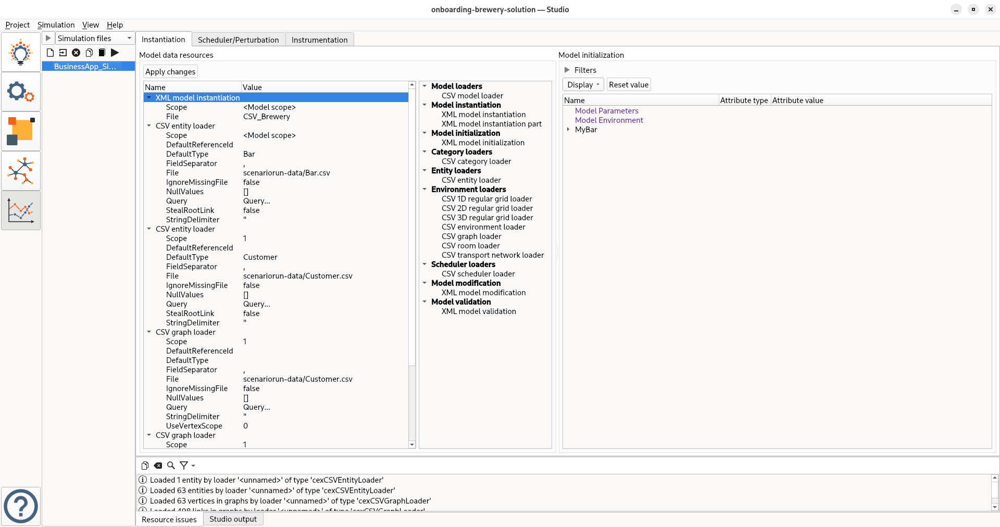

# Customize an existing Solution

Now that you have learned how to deploy a Solution, it's time to create your own version.

You will now switch from working in the `build-my-app-training-workspace` repository to the `onboarding-brewery-solution` repository.

## First look at the Simulator

Let's start by examining the simulator and reviewing the main files used to define a Simulation.

```text title="Project content"
.
├── code
│   └── run_templates
│       ├── ETL
│       │   └── run.json
│       ├── Example
│       │   └── run.json
│       └── scripts
│           ├── display_csm_env.py
│           ├── get_logger.py
│           ├── __init__.py
│           ├── run_simulator.py
│           └── use_default_dataset.py
├── ConceptualModel
│   └── MyBrewery.csm.xml
├── LICENSE
├── project.csm
├── README.md
├── Simulation
│   ├── BusinessApp_Simulation.sml.xml
│   └── Resource
│       ├── CSV_Brewery.ist.xml
│       └── default_dataset
│           ├── arc_to_Customer.csv
│           ├── Bar.csv
│           └── Customer.csv
└── Simulator
    └── Simulator.sor.xml
```

In this project, 4 files are of primary importance:

- `ConceptualModel/MyBrewery.csm.xml`: This contains the actual model of the simulation, with all the model and logic of the Simulation
- `Simulator/Simulator.sor.xml`: This defines the Simulator itself which is a combination of a Conceptual Model and probes that will be able to export data during a simulation
- `Simulation/BusinessApp_Simulation.sml.xml`: This is the description of a simulation, that will instantiate entities and then define how the simulation runs, accompanied by the definition of Consumers that will consume the data from the probes and export them in different formats
- `Simulation/Resource/CSV_Brewery.ist.xml`: This is an instance of a simulation that will make use of CSV files to generate entities and add them to the simulation

## Look up using the Studio

By opening the project in the studio, you can examine the model more closely. If you completed the Brewery modeling tutorial, you will already be familiar with this model.

The first view you will encounter is the Conceptual Model Editor:

!!! info "Conceptual Model Editor"
    

In this view, you can navigate through your model and examine every element that composes it. Since the model is already built in this case, we won't go into detail here.

But remember, any change in this view will be reflected in the `ConceptualModel/MyBrewery.csm.xml` file.

The second view is the Simulator Editor

!!! info "Simulator Editor"
    

In this view, you define how your model can be executed by giving it a name and configuring probes.

Probes are the primary method for accessing data outside your simulator, enabling you to retrieve results and utilize the probe data.

Any change here will be reflected in the `Simulator/` directory and the `Simulator.sor.xml` file

!!! warning "Checkpoint"
    By now you have reviewed the model. Any changes you made will be applied in further steps.
    However, for the rest of this session, we will assume no changes were made.

## Building your simulator

We will continue using the Studio for the following steps. However, you can also use equivalent commands with the `csm` CLI that is installed alongside the studio. You'll find the useful commands at the end of this page.

Now let's move to the third view, which is the most important one for today's work: the Solution Builder.

!!! info "Solution Builder"
    

In this view, you will configure the build process for the Simulator defined in the previous views.

Once the build is successful, you must restart the Studio for the changes to take effect.

The content generated by the build process will be placed in a `Generated` folder by default.

!!! warning "Checkpoint"
    By now you should have a built simulator, you can check if it is working by running `Generated/Build/Bin/csm-simulator --version`.
    This command will return you the info it has on the simulator you built.

## Defining and running simulations

Now that you have a working simulator, it's time to define and run some simulations.

To define a simulation, you need to complete 2 steps: instantiate a model, then simulate it.

The 4th view will help you instantiate a model: the Instantiated Model Editor.

!!! info "Instantiated Model Editor"
    

Here you will define your model instance.
In the current state any change will be reflected in `Simulation/Resource/CSV_Brewery.ist.xml`

The CSV_Brewery requires CSV files in a specific folder: `Simulation/Resource/scenariorun-data`. This folder doesn't exist yet, but you can create it by copying `Simulation/Resource/default_dataset` for now.

!!! warning "Checkpoint"
    Make sure to have created the `scenariorun-data` folder or the next step won't work.

Now that you have a model, you can simulate it. The 5th and final view of the Studio will help you with this.

!!! info "Simulation Manager"
    

In this view, you will define the simulation schedule, specify which instance to use, and configure the consumers that will process the probe data.

Changes in this view will be reflected in `Simulation/BusinessApp_Simulation.sml.xml`

If everything has worked correctly up to this point, you can run the simulation and output data should be generated in the `Simulation/Output` folder.

This concludes our exploration of the model.

## Useful `csm` commands

```bash title="csm commands"
# To quickly build a simulator
csm flow

# The previous command is equivalent to running the following ones
csm generate       # Generate the code base
csm configure      # Configure the build process
csm build          # Run the build

# Once you have build a simulator you can easily run it
csm simulate <Simulation_name>
# Simulation_name is the base name of any .sml.xml file you created, so here you could run the following command

csm simulate BusinessApp_Simulation
```

The next step will be to use your newly built simulator to integrate and work with external data.
