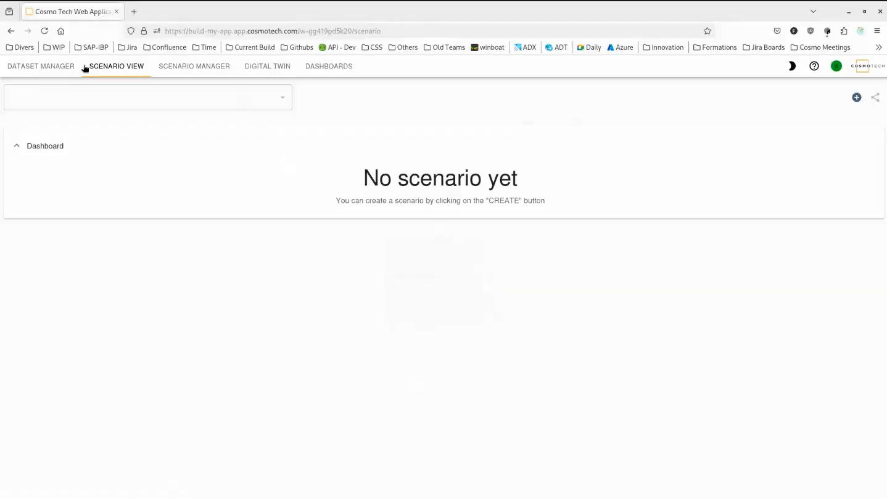

# Front-end

Learn about the Cosmo Tech web application interface and how to create datasets and scenarios to run simulations.

The Cosmo Tech web application provides an intuitive interface for:
- Creating and managing datasets.
- Configuring and running scenarios.
- Monitoring simulation execution.
- Visualizing results through Power BI dashboards.

This guide walks you through the essential steps to get started with your first simulation.

## Creating a dataset

Datasets contain the input data that your scenarios will use for simulations. Before running any scenario, you need to create at least one dataset.

### Step 1: Navigate to the Dataset view

When you first access a workspace with no datasets, you'll see an empty dataset view.

### Step 2: Enter dataset information

Click the **Create Dataset** button and provide the basic information:

- **Name**: a descriptive name for your dataset.
- **Description**: optional details about the dataset contents.
- **Tags**: optional labels for organization.

### Step 3: Configure data source

Select your data source type and configure the connection parameters:

- **Source type**: choose from available connectors (ADT, Azure Storage, Local File, etc.).
- **Connection parameters**: provide authentication and location details.
- **Data mapping**: configure how data should be imported.

### Step 4: Dataset import

The web application will begin importing your data. Depending on the data size, this may take a few moments.

Once the import is complete, your dataset will be ready to use in scenarios.

## Creating a scenario

Scenarios define the simulation parameters and execution settings. Each scenario is linked to a dataset and a run template.

### Step 1: Navigate to the Scenario view

When you first access a workspace with no scenarios, you'll see an empty scenario view.

### Step 2: Configure scenario details

Click the **Create Scenario** button and provide the configuration:

- **Name**: a descriptive name for your scenario.
- **Description**: optional details about what this scenario simulates.
- **Run Template**: select the type of simulation to execute.
- **Dataset**: choose the dataset created in the previous steps.
- **Parameters**: configure scenario-specific parameters based on the selected run template.

### Step 3: Scenario created

Once created, your scenario is ready to run. You can modify parameters or execute the simulation.

## Running a scenario

### Execute the simulation

Click the **Run** button to start the simulation. The scenario will be submitted to the execution queue.

### Monitor progress

The web application displays the execution status in real-time:

- **Pending**: waiting for resources.
- **Running**: simulation in progress.
- **Successful**: completed successfully.
- **Failed**: execution encountered an error.

### View results

Once the scenario has finished running successfully, you can:

- View results in the **Dashboards** tab (Power BI reports).
- Analyze data directly in **Azure Data Explorer**.
- Compare results with other scenarios.
- Export data for further analysis.

The simulation output data is automatically sent to Event Hub, ingested into ADX, and made available for visualization in Power BI dashboards.

## Next steps

After running your first scenario:

1. **Explore Results**: navigate to the Dashboards tab to view Power BI reports
2. **Create Variations**: clone your scenario and adjust parameters to explore different outcomes
3. **Compare Scenarios**: use comparison features to analyze differences
4. **Query Raw Data**: access ADX directly for custom data analysis
5. **Share Insights**: export reports and share findings with your team

## Tips and Best Practices

- **Naming Conventions**: use clear, descriptive names for datasets and scenarios.
- **Dataset Reuse**: multiple scenarios can share the same dataset.
- **Parameter Documentation**: add descriptions to help others understand your scenario configuration.
- **Version Control**: create scenario clones before making significant changes.
- **Monitor Resources**: check execution status and logs if a scenario fails.
- **Validate Data**: ensure datasets are correctly imported before running scenarios.

## Troubleshooting

### Dataset Import Issues

- Verify connection parameters and authentication.
- Check data source accessibility.
- Review error messages in the dataset details.

### Scenario Execution Failures

- Confirm the dataset is valid and complete.
- Check parameter values are within acceptable ranges.
- Review execution logs for error details.
- Verify the Docker image is available in the registry.

### Dashboard Not Loading
- Ensure the scenario has completed successfully.
- Verify Power BI workspace permissions.
- Check that ADX contains the expected data.
- Refresh the dashboard view.

## References

For more detailed information on the front-end, please refer to:

- [azure-sample-webapp](https://github.com/Cosmo-Tech/azure-sample-webapp/tree/main/doc)
- [Web App User Guide](https://portal.cosmotech.com/resources/platform-resources/web-app-user-guide/web-app-user-guide-6-4)
